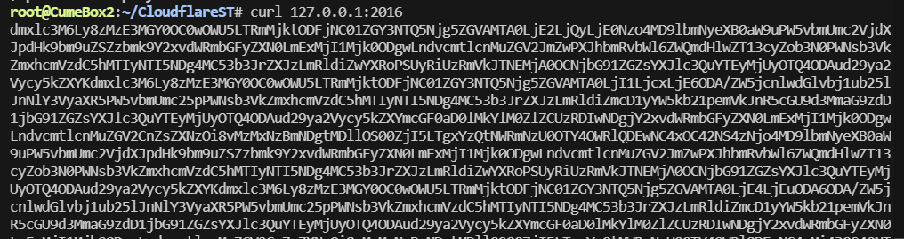
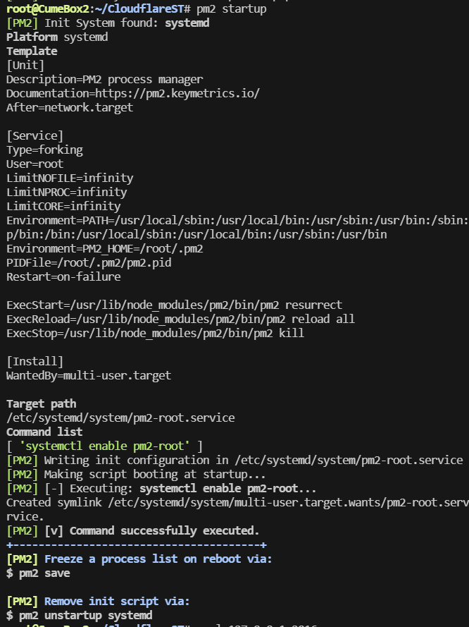

# 优选IP脚本设置定时更新优选ip
## windows 直接解压执行bat
## 服务器
* 用ssh连接软件连接服务器
```Bash
以下脚本不建议在公网ip使用
适用于本地
down.sh 下载适配文件支持win10,ubuntu,arm64(我只有这些设备)    
v2ray.js Node.js服务器，它提供了两个路由(/v2ray1和/v2ray2)  
```

```Bash
git clone http://gitproxy.mrhjx.cn/https://github.com/StarzL1kerain/CloudflareST.git
cd CloudflareST
npm i
# 下载 CloudflareST 压缩包（自行根据需求替换 URL 中版本号和文件名）
# 支持x86_64,Linux 64位,aarch64一键下载解压
# 运行 down.sh (win10在git bash执行)
# 参考.env.example创建.env文件
cp .env.example .env
vi .env

sh down.sh 
# 赋予执行权限
# chmod +x CloudflareST && chmod +x CloudflareST.sh
# 首次建议测试一下
修改CloudflareST.sh文件的cd ~/CloudflareST/
改为你自己的对应目录
默认在当前用户目录下
任选其一
- ./CloudflareST.sh
- bash ./CloudflareST.sh

# npm install -g pm2
pm2 start v2ray.js
curl 127.0.0.1:2016
```

`pm2 save`
设置开机自启
`pm2 startup`
部分用户可能需要再输一行指令
看pm2 提示
比如 
`pm2 stasudo env PATH=$PATH:/usr/bin /usr/lib/node_modules/pm2/bin/pm2 startup systemd -u ubuntu --hp /root`



## 修改于CloudflareSpeedTest
```
* 请参考 [CloudflareSpeedTest](https://github.com/XIU2/CloudflareSpeedTest)
```